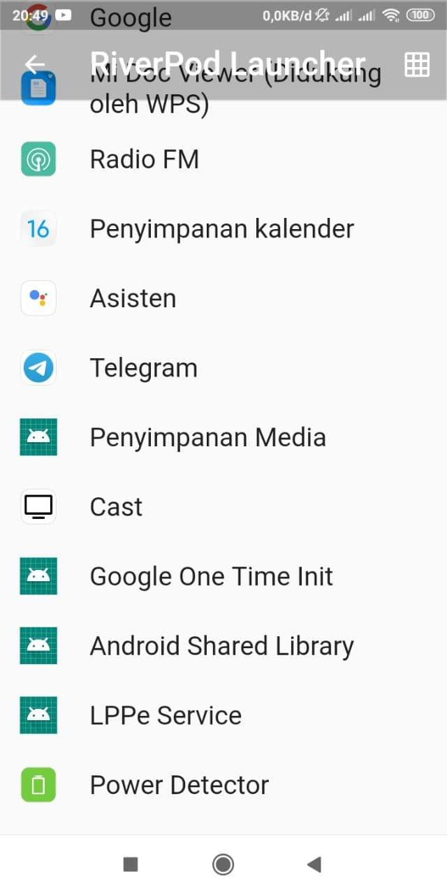
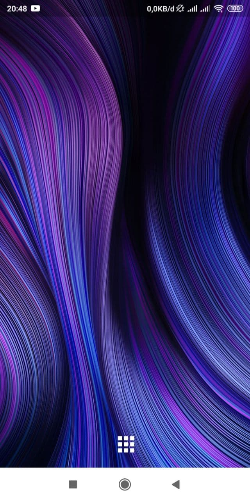
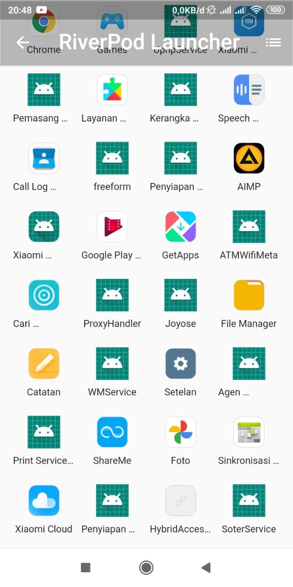

# Android Launcher

## Preview

  

## Features

- Uses [riverpod](https://riverpod.dev) as state management
- Displays system wallpaper as background
- List applications in Grid or List view
- Launch applications
